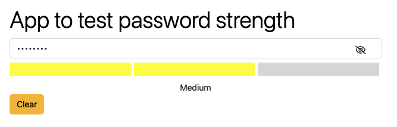

# App to test password strength

This is a simple app to test password strength. It contains a field for entering a password and 3 sections which will show the strength of the password.
The color of the sections will depend on the strength of the password:
- If the field is empty, all sections are gray;
- If the field has less than 8 characters, all sections are red;
- If the password is easy - the first section is red the rest are gray;
- If the password is medium - the first two sections are yellow the last one is gray;
- If the password is strong, all sections are green;

  

### [Link to live page](https://tinkkid.github.io/test-password-strength/)

## Technologies

This project was generated with [Angular CLI](https://github.com/angular/angular-cli) version 16.1.0.

## Development server

Run `ng serve` for a dev server. Navigate to `http://localhost:4200/`. The application will automatically reload if you change any of the source files.
